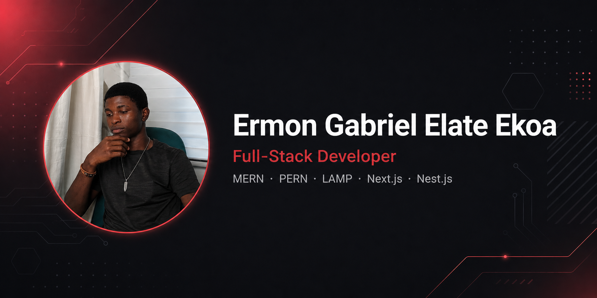

<h1 align="center">Hi there, I'm Ermon Gabriel 👋</h1>

<h3 align="center">Full-Stack Developer | MERN · PERN · LAMP · Next.js · Nest.js</h3>

  

  

<!--
  ⬆️ Replace the banner URL above with your own image.
  Easiest option: upload an image to this repo (drag & drop into GitHub's
  file editor) then right-click → copy the raw link and paste it here.
-->

---

## 🧑‍💻 About Me

I'm a full-stack developer with hands-on experience building web
applications from the ground up — UI, APIs, databases, and everything in
between. I've collaborated remotely with international clients, which
means I'm comfortable working async, communicating clearly in English,
and owning a project from start to finish without hand-holding.

I care about **clean code, performance, and security** — not just making
things work, but making them work well.

- 🔭 Currently working on **Bloom Market** (e-commerce platform) at Osmos
- 🌱 Currently deepening my skills in **Next.js, Nest.js & PostgreSQL**
- 🌍 Open to **remote roles** and **relocation**
- 💬 Fluent in **French** (native) and **English** (professional)
- 📫 Reach me: **ermongabriel.tech@gmail.com**

---

## 🔧 Tech Stack

  

| Category | Technologies |
|---|---|
| **Frontend** | React, Next.js, HTML5, CSS3, Tailwind CSS |
| **Backend** | Node.js, Nest.js, Express, PHP |
| **Databases** | MongoDB, PostgreSQL, MySQL |
| **Tools & Workflow** | Git, GitHub, GitLab, Docker, Postman |
| **Also comfortable with** | Python, UML |

---

## 🚀 Featured Projects

<table>
  <tr>
    <td width="50%">
      
       
      <b>Project Name One</b>
       
      Short description — what it does, what problem it solves, and the
      stack used.
       
      <a href="https://project-one-live-link.vercel.app">🔗 Live Demo</a> ·
      <a href="https://github.com/yourusername/project-one">💻 Code</a>
    </td>
    <td width="50%">
      
       
      <b>Project Name Two</b>
       
      Short description — what it does, what problem it solves, and the
      stack used.
       
      <a href="https://project-two-live-link.vercel.app">🔗 Live Demo</a> ·
      <a href="https://github.com/yourusername/project-two">💻 Code</a>
    </td>
  </tr>
</table>

<!--
  ⬆️ Duplicate this block for a 3rd/4th project if you want a 2x2 grid.
  Replace the image URLs with real screenshots from your own repos.
-->

---

## 📊 GitHub Stats

  
  

  

<!-- Replace "yourusername" in the 3 lines above with your real GitHub username -->

---

## 🌐 Find Me Elsewhere

  
  
  
  
  
  
  

<!-- Replace "yourhandle" in each link above with your real usernames -->

---

  <i>Thanks for stopping by — feel free to explore my pinned repos below ⬇️</i>

