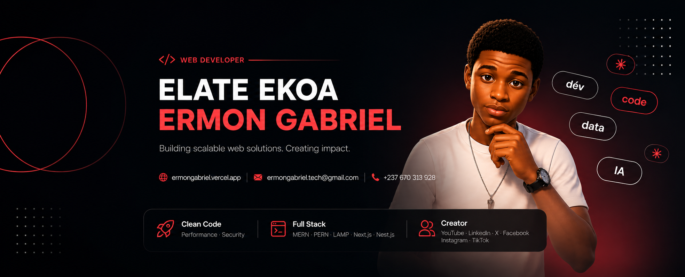

  <!-- Banner -->
  
  
  <!-- Animated Typing -->
  
   
  <!-- Recruiter Quick-Scan Badges -->
  

    
    
    
    
  

  
  
  
  

 
🧑‍💻 About Me
I'm a full-stack developer with hands-on experience building web applications from the ground up — UI, APIs, databases, and everything in between. I've collaborated remotely with international clients, which means I'm comfortable working async, communicating clearly in English, and owning a project from start to finish without hand-holding.
I care about clean code, performance, and security — not just making things work, but making them work well.
🔭 Currently working on Bloom Market (e-commerce platform) at Osmos
🌱 Currently deepening my skills in Next.js, Nest.js & PostgreSQL
🌍 Open to remote roles and relocation
💬 Fluent in French (native) and English (professional)
📫 Reach me: ermongabriel.tech@gmail.com
🛠 Tech Stack
🟥 Production-Ready

  
  

I ship features with these daily. Comfortable with architecture decisions, performance tuning, and debugging production issues.
🟧 Comfortable With

  

I've built and deployed with these. Might reference docs for edge cases, but I won't block a sprint.
🟨 Currently Exploring

  

Not production-ready yet, but I'm actively building side projects with these.
🚀 Featured Projects
<table>
  <tr>
    <td width="50%" valign="top">
      
        
      <h3 align="center">DO</h3>
      

        
        
        
        
      

      

        Multi-tenant SaaS platform improving communication flow between institutions and students. Features real-time messaging, role-based access, and collaborative workspaces.
      

      

        <a href="https://do-sage.vercel.app" target="_blank">🔗 Live Demo</a> ·
        <a href="https://github.com/ermongabriel/do-web" target="_blank">💻 Source Code</a>
      

    </td>
    <td width="50%" valign="top">
      
        
      <h3 align="center">Your Next Project</h3>
      

        
        
        
      

      

        <em>Tip: Add your second-best project here with a screenshot, live demo, and tech badges. Recruiters love seeing variety across your stack.</em>
      

      

        <a href="#" target="_blank">🔗 Live Demo</a> ·
        <a href="#" target="_blank">💻 Source Code</a>
      

    </td>
  </tr>
</table>
🏆 GitHub Trophies

  

📊 GitHub Analytics

  
  

 

  

 

  

 

  <picture>
    <source media="(prefers-color-scheme: dark)" srcset="https://raw.githubusercontent.com/ermongabriel/ermongabriel/output/github-snake-dark.svg"/>
    <source media="(prefers-color-scheme: light)" srcset="https://raw.githubusercontent.com/ermongabriel/ermongabriel/output/github-snake.svg"/>
    
  </picture>

🌐 Find Me Elsewhere

  

    <strong>I'm currently open to new opportunities.</strong> 
    Whether you're hiring, collaborating, or just want to say hi — my inbox is open.
  

   
  
    
  
  
  
  
  

  
   
  <i>Thanks for stopping by — feel free to explore my pinned repos below ⬇️</i>

